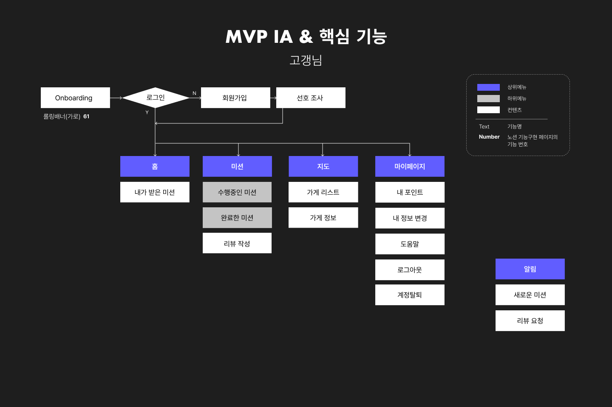

가보자고chap3   
  
  데이터베이스를 설계하는 법을 배웠다.
  MySQL로 데이터베이스를 설계할 것이므로, 설계하기 전에 ERD를 만들어야 한다.  

  주어진 조건은 다음과 같다.

  1. 주어진 IA(기획 플로우)와 와이어 프레임(디자인 프로토타입)을 보고 직접 데이터베이스를 설계해오기, 위에서 언급한 경우를 다 적용해서 할 것
  2. 이름 글자 수 등 세부적인 부분은 원하는 대로 해도 됨!
  3. 각 지역 별로 가게들이 있으며 가게를 방문하는 미션을 해결하며 포인트를 모으는 서비스
      1. 모든 지역마다 10개의 미션 클리어시 1000 point 부여로 고정   

우선 어떤 table이 들어갈지 생각해본다.  
기본적인 회원의 정보, 회원마다 선호사항, 가게마다 있는 미션, 리뷰 등을 만들어야 한다. 이때, 미션과 회원, 회원과 선호사항은 다대다 연결로 생각하여 중간에 table을 하나 더 만들었다.   
  
결과는 다음과 같다.
  
  
이후에는 로컬 컴퓨터가 아닌 외부 컴퓨터를 빌려 데이터베이스를 활용하기 위해 AWS의 RDS를 이용하기로 했다.   
RDS는 만일을 대비해 2개의 서브넷을 지정해야 하기 때문에 2개를 만들었다. - 이때 가용영역을 다르게 해야된다.  

    
 
이후 VPC에서 DNS 설정을 활성화 해준 뒤 앞에 만든 서브넷을 DB 서브넷 그룹으로 생성한다.    

  
밑에처럼 완성해버렸다.
  
  
이후 datagrip에 원격으로 연결했다.

  
끝!