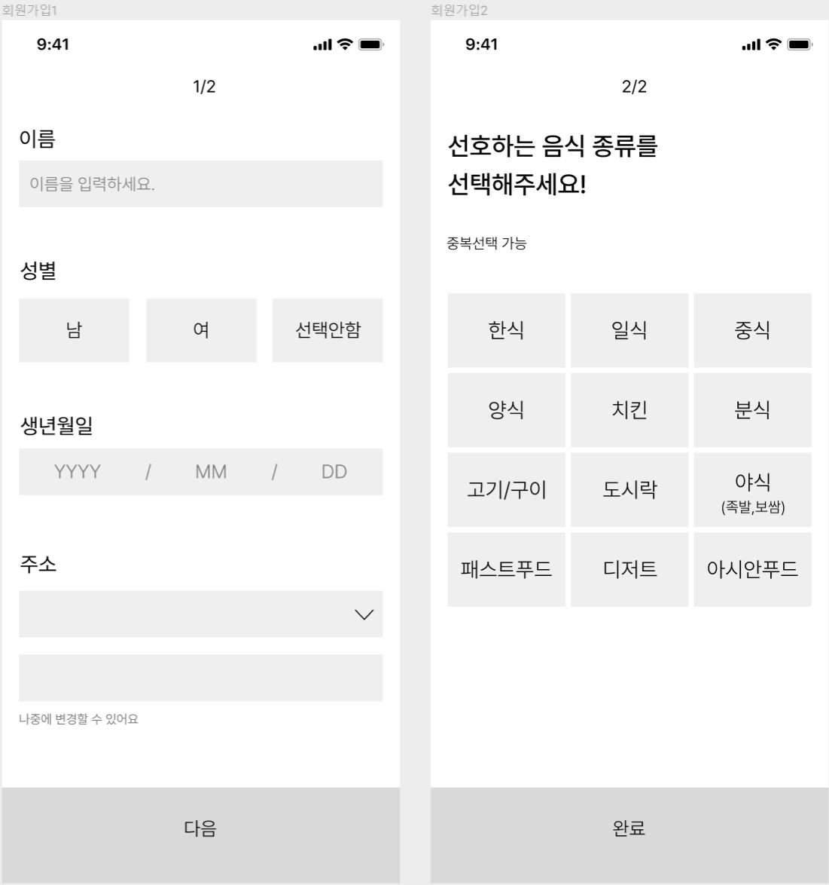
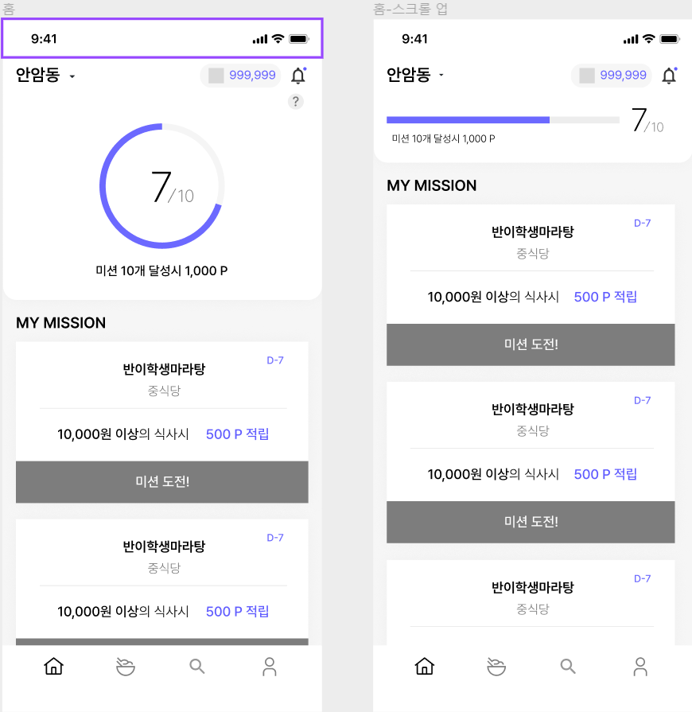
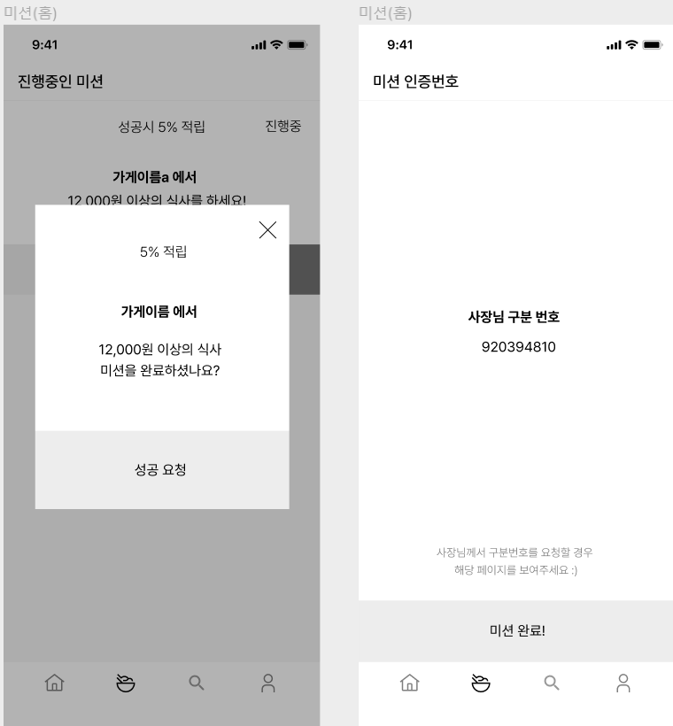

각자의 페이지에서 가져와야 하는것이 무엇인지 먼저 정리하고 api 를 짜 보겠다

1. 회원가입
이름
성별
생년월일
주소
선호하는 음식

이후 key를 가져온다

2. 홈화면
지역명
내가 달성한 미션들 개수
내가 도전할 수 있는 미션들 쭉 보여주기 (
    미션하는 가게 이름, 
    미션하는 가게의 식당분류,
    미션 종료시간 - d-7,
    미션이 달성되는 조건
)

3. 미션 완료
하나의 미션 (
    가게 이름,
    미션 성공시 보상 - 5%적립,
    미션이 달성되는 조건
)

이후 사장님 구분 번호를 가져온다

.png)
4. 미션 목록 조회
진행중인 미션들 목록
하나의 미션 (
    가게 이름,
    미션 성공시 보상 - 5%적립,
    미션이 달성되는 조건
)

진행완료 미션들 목록
하나의 미션 (
    가게 이름,
    미션 성공시 보상 - 5%적립,
    미션이 달성되는 조건
)

5.마이페이지 리뷰작성
내 포인트
포인트 내역 - 진행완료 미션들 목록
리뷰 클릭시 그 가게에 대한 모든 리뷰
내가 작성한 리뷰
